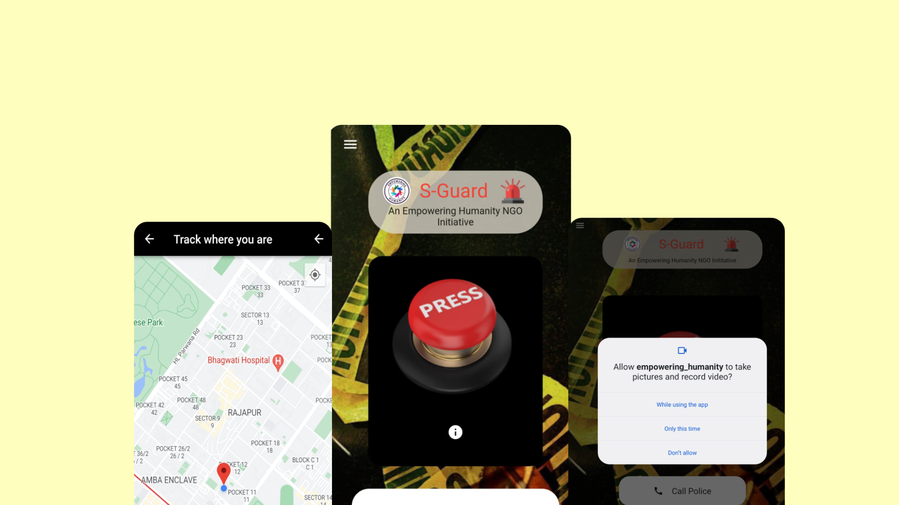

#  S-Guard

## An Empowering Humanity NGO Initiative

SGuard is a client focussed emergency system based in Flutter. The product assures safety through an interconnnected NGO channel, and lets you live-ping your audio, video and location in real time during panic situations. 

You can read more about the app and it's development process [here](https://thisiskashvi.hashnode.dev/s-guard).

### Getting Started 
Technology Used:

- Flutter : To get started with flutter head over to https://flutter.dev
- Firebase : To learn how to integrate firebase with flutter head over to https://firebase.flutter.dev/docs/overview

Major Packages:

- `cloud_firestore`
- `firebase_auth`
- `flutter_webrtc`
- `google_maps_flutter`

### Current Features
1. You can add upto 2 emergency contacts and directly ping them in emergency situations.
2. Single tap the SOS to immediately ping your live location to your safety contact circle and alert the police.
3. Double tap to activate critical alert (realtime video, audio and locale transfer to NGO officials.)
4. App allows singly dialing police helplines.

### Future To-Do
1. Allow direct login through google and/or phone number.
2. Add upto 4 emergency contacts.
3. Add demo receiver page to demonstrate P2P communication.
4. Integrate multi-country support for police calls.
5. Integrate nearby hospital functionality. 
6. Add direct in-app calling and messaging.

